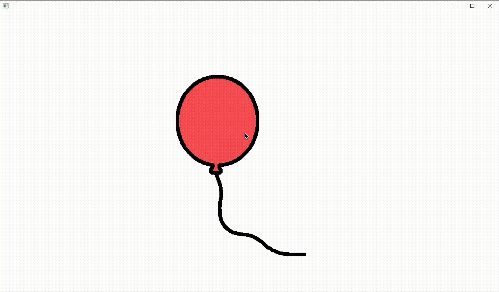

## Samostatná úloha
 - Vytovřete aplikaci v Java FX, kde se bude náhodně pohyboavt balonek po plátně.
 - Po kliknutí na balonek balonek praskne a vytvoří se nový na náhodných souřadnicích. 
 - Balonek můžete animovat střídáním textur v resources/images/



### Postup
- Nejprve si vytvořete jednoduchý objekt s namapovanou texturou (jednoho obrázku)
- Přidejte AnimationTimer a metodu  tick() která se bude volat s každým překreslením obrazovky.
- Následně rozpohybujte obrázek po plátně
- Přidejte detekci hran obrazovky aby obrázek neutíkal mimo plátno, ale odrazil se při kontaktu s hranou okna. Směr odrazu můžete volit opačný, nebo náhodně.
- Přidejte reakci na kliknutí myši a implementujte logiku, kdy je po kliknutí myši detekováno, zda se na kliknutých souřadnicích nachází balónek (nezapomeňte započítat velikost textury).
- Implementujte logiku střídání textur pro vytvoření iluze animace. 
- Po detekci kliknutí na balónek změňte textury a po dokončení animace vygenerujte nový balonek na náhodných souřadnicích. 


#### Názvy souborů pro textury
```
public static final List<String> STANDARD_TEXTURES = List.of("pohyb1.png", "pohyb2.png", "pohyb3.png", "pohyb4.png", "pohyb5.png", "pohyb6.png", "pohyb7.png", "pohyb8.png", "pohyb9.png", "pohyb10.png", "pohyb11.png", "pohyb12.png", "pohyb13.png", "pohyb14.png", "pohyb15.png", "pohyb16.png", "pohyb17.png", "pohyb18.png", "pohyb19.png", "pohyb20.png");

public static final List<String> POP_TEXTURES = List.of("pop1.png","pop2.png", "pop3.png", "pop4.png", "pop5.png", "pop6.png", "pop7.png", "pop8.png", "pop9.png", "pop10.png", "pop11.png");
```

